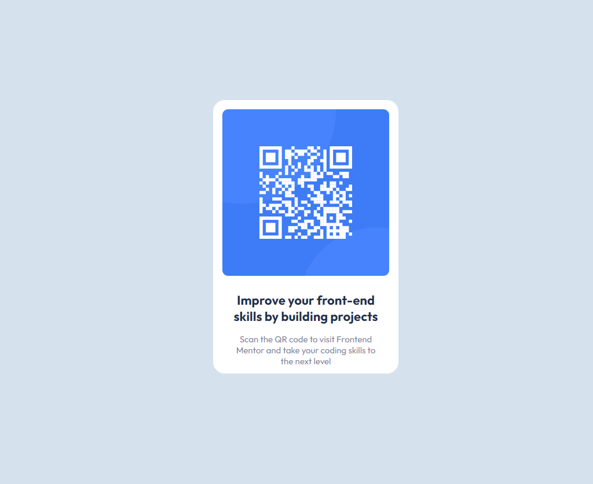

# Frontend Mentor - QR code component solution

This is a solution to the [QR code component challenge on Frontend Mentor](https://www.frontendmentor.io/challenges/qr-code-component-iux_sIO_H). Frontend Mentor challenges help you improve your coding skills by building realistic projects.

## Table of contents

- [Overview](#overview)
  - [Screenshot](#screenshot)
  - [Links](#links)
- [My process](#my-process)
  - [Built with](#built-with)
  - [What I learned](#what-i-learned)
  - [Continued development](#continued-development)
- [Author](#author)

## Overview

### Screenshot



### Links

- Solution URL: [Git solution](https://github.com/mksmmirhs/Frontend-Mentor---QR-code-component)
- Live Site URL: [Live url](https://mksmmirhs.github.io/Frontend-Mentor---QR-code-component/)

## My process

### Built with

- Semantic HTML5 markup
- CSS custom properties
- Flexbox

### What I learned

I have used box shadow , media query , flex to make element center

To see how you can add code snippets, see below:

```css
body {
  background-color: #d5e1ef;
  height: 100vh;
  display: flex;
  justify-content: center;
  align-items: center;
}
@media (max-width: 375px) {
  .card-container {
    height: 497px;
    box-shadow: 0px 4px 4px 0px rgba(0, 0, 0, 0.25);
  }
}
```

### Continued development

I really want to focus on pixel perfect design. It takes time for me now but I will focus to improve my coding speed further.

## Author

- Website - [Mohammed Merajul Islam](https://port-folio-bc9a1.web.app/)
- Frontend Mentor - [@mksmmirhs](https://www.frontendmentor.io/profile/mksmmirhs)
